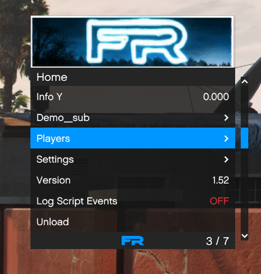

# Old Bigbase V1 UI

This is my old ui for bigbase v1 but i dont need it anymore because the dev of solar mod menu stole it, and the new paragon menu (Frontier) stole my menus name. 

Includes:

Custom scrollbar like impulse's

YTD loader for a custom header 

Controller support

Save / Load theme settings

Misc other changed

UI:

I will not provide support for this!

Credits:
Pocakking - Bigbase v1
Cave - making it
